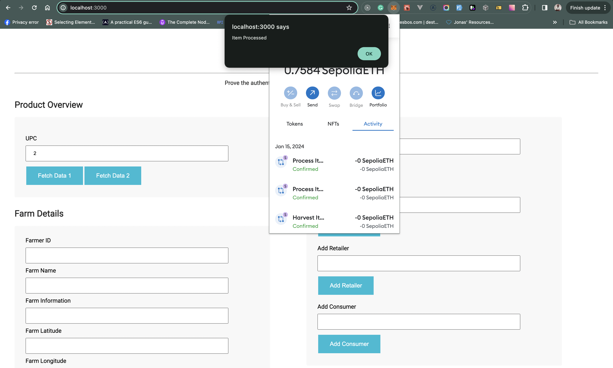
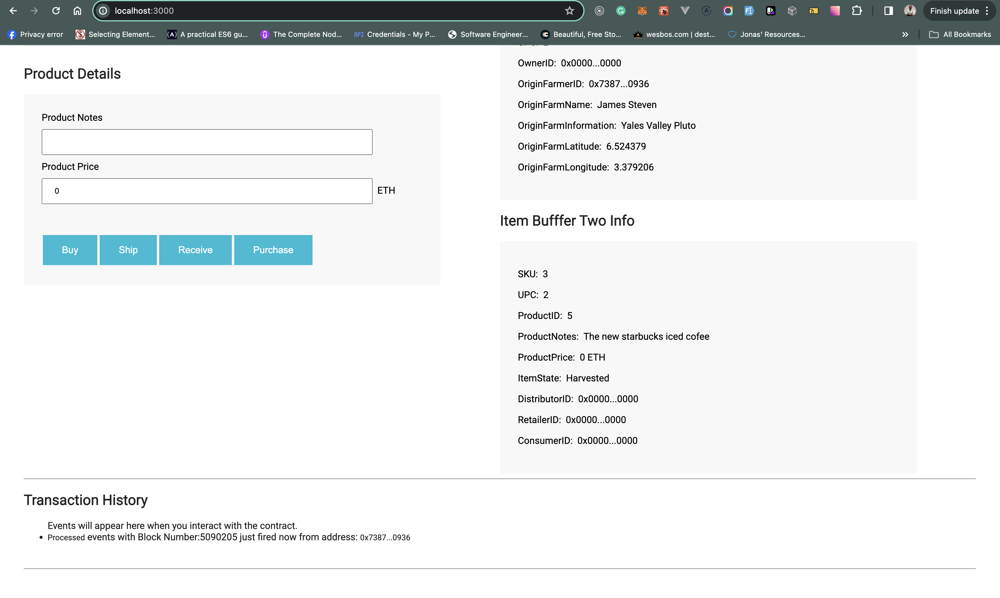

# Supply chain & data auditing

This repository containts an Ethereum DApp that demonstrates a Supply Chain flow between a Seller and Buyer. The user story is similar to any commonly used supply chain process. A Seller can add items to the inventory system stored in the blockchain. A Buyer can purchase such items from the inventory system. Additionally a Seller can mark an item as Shipped, and similarly a Buyer can mark an item as Received

The DApp User Interface when running should look like...





## Contract Address on Sepolia TestNet

0x074f9241b60987926c7cafb6cbe6f7444827fb38

### Points to note when starting app.

have a `.secret` file inside the truffle folder `truffle/.secret` and add your mnemonic (secret key to sign transactions)

run `ganache` locally in the terminal, to start up a local ethereum node.

run `truffle test --network development --reset` to test

run `truffle migrate --network development --reset` to run a migration.

run all truffle related commands inside the truffle directory in the terminal.

on another terminal, run an `npm start` to start your react app

dependency in truffle folder

```
"dependencies": {
    "@truffle/hdwallet-provider": "^2.1.15"
  }
```

dependency in react folder.

```
"dependencies": {
    "react": "^18.2.0",
    "react-dom": "^18.2.0",
    "@metamask/detect-provider": "^2.0.0",
    "web3": "^4.3.0"
  },
```
